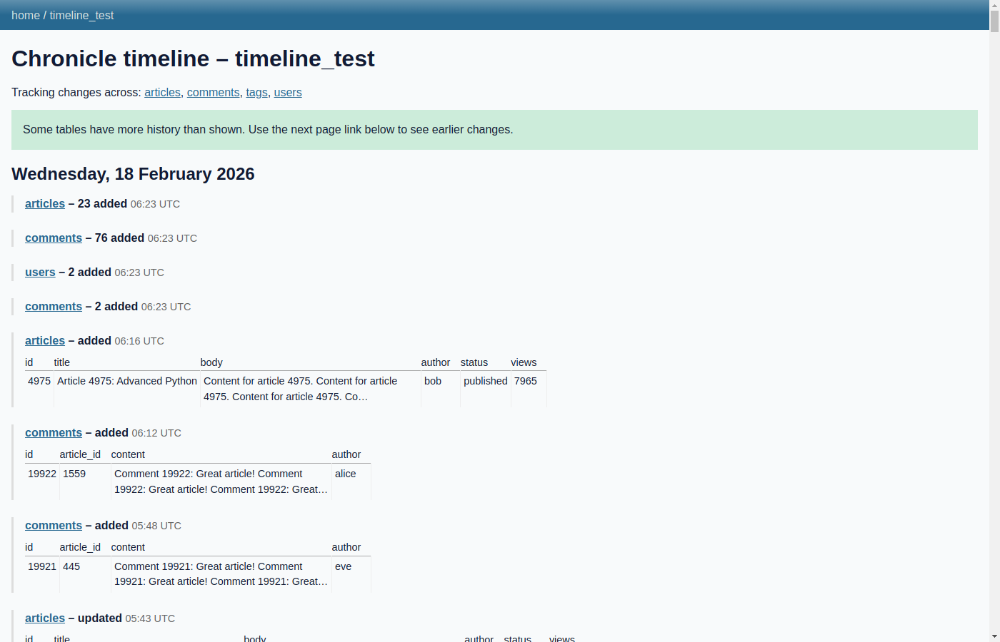

# Chronicle Timeline Query Research

*2026-02-18T05:57:40Z by Showboat 0.6.0*
<!-- showboat-id: 4700e0d9-48d5-4200-9705-75994c15b1d1 -->

This document explores query patterns for building a paginated timeline of recent changes across multiple SQLite tables that have chronicle enabled. The challenge: we need to combine events from multiple chronicle tables, ordered by time (__updated_ms), but there is only an index on __version, not on timestamps.

## Key Query Challenge

The problem: combine chronicle events from multiple tables ordered by __updated_ms (time), but only __version is indexed. Strategy: use ORDER BY __version DESC with geometric probe limits (10, 100, 1000, 10000) to find the right scan depth without overshooting badly. Within each probe, SQLite only reads N index entries from the end — very fast.

For the UNION ALL approach, each table contributes its top K rows by version, we combine and sort by timestamp. The question is: what K is right for a 'one page of timeline' view?

```python3
import sqlite3, random
import sqlite_chronicle

conn = sqlite3.connect("/tmp/timeline_test.db")
conn.execute("PRAGMA journal_mode=WAL")
conn.execute("PRAGMA foreign_keys=OFF")

tables = {
    "articles": "CREATE TABLE articles (id INTEGER PRIMARY KEY, title TEXT, body TEXT, author TEXT, status TEXT, views INTEGER)",
    "comments": "CREATE TABLE comments (id INTEGER PRIMARY KEY, article_id INTEGER, content TEXT, author TEXT)",
    "users": "CREATE TABLE users (id INTEGER PRIMARY KEY, name TEXT, email TEXT, bio TEXT)",
    "tags": "CREATE TABLE tags (id INTEGER PRIMARY KEY, name TEXT, slug TEXT)",
}

for name, schema in tables.items():
    conn.execute(f"DROP TABLE IF EXISTS _chronicle_{name}")
    conn.execute(f"DROP TABLE IF EXISTS {name}")

conn.commit()

for name, schema in tables.items():
    conn.execute(schema)

conn.commit()

for name in tables:
    sqlite_chronicle.enable_chronicle(conn, name)

print("Tables created and chronicle enabled")
print("Chronicle tables:", sqlite_chronicle.list_chronicled_tables(conn))

```

```output
Traceback (most recent call last):
  File "<string>", line 2, in <module>
ModuleNotFoundError: No module named 'sqlite_chronicle'
```

```bash
python3 -c 'import sqlite_chronicle; print(sqlite_chronicle.__file__)'
```

```output
Traceback (most recent call last):
  File "<string>", line 1, in <module>
ModuleNotFoundError: No module named 'sqlite_chronicle'
```

```bash
which python3 && python3 -c 'import sys; print(sys.path)'
```

```output
/root/.cache/uv/archive-v0/nxoF1C54GPFJIYIEB4JHd/bin/python3
['', '/usr/lib/python311.zip', '/usr/lib/python3.11', '/usr/lib/python3.11/lib-dynload', '/root/.cache/uv/archive-v0/nxoF1C54GPFJIYIEB4JHd/lib/python3.11/site-packages']
```

```bash
/root/.cache/uv/archive-v0/nxoF1C54GPFJIYIEB4JHd/bin/python3 -m pip install sqlite-chronicle 2>&1 | tail -3
```

```output
/root/.cache/uv/archive-v0/nxoF1C54GPFJIYIEB4JHd/bin/python3: No module named pip
```

```bash
python3 -c 'import sqlite_chronicle; print("OK:", sqlite_chronicle.__file__)'
```

```output
Traceback (most recent call last):
  File "/usr/lib/python3.11/importlib/metadata/__init__.py", line 563, in from_name
    return next(cls.discover(name=name))
           ^^^^^^^^^^^^^^^^^^^^^^^^^^^^^
StopIteration

During handling of the above exception, another exception occurred:

Traceback (most recent call last):
  File "<string>", line 1, in <module>
  File "/root/.cache/uv/archive-v0/nxoF1C54GPFJIYIEB4JHd/lib/python3.11/site-packages/sqlite_chronicle.py", line 7, in <module>
    __version__ = _get_version("sqlite-chronicle")
                  ^^^^^^^^^^^^^^^^^^^^^^^^^^^^^^^^
  File "/usr/lib/python3.11/importlib/metadata/__init__.py", line 1009, in version
    return distribution(distribution_name).version
           ^^^^^^^^^^^^^^^^^^^^^^^^^^^^^^^
  File "/usr/lib/python3.11/importlib/metadata/__init__.py", line 982, in distribution
    return Distribution.from_name(distribution_name)
           ^^^^^^^^^^^^^^^^^^^^^^^^^^^^^^^^^^^^^^^^^
  File "/usr/lib/python3.11/importlib/metadata/__init__.py", line 565, in from_name
    raise PackageNotFoundError(name)
importlib.metadata.PackageNotFoundError: No package metadata was found for sqlite-chronicle
```

```bash
python3 -c 'import sqlite_chronicle; print("OK:", sqlite_chronicle.__version__)'
```

```output
OK: 0.6.1
```

```python3
/home/user/datasette-chronicle/experiments/gen_test_db.py
```

```output
  File "<string>", line 1
    /home/user/datasette-chronicle/experiments/gen_test_db.py
    ^
SyntaxError: invalid syntax
```

```bash
python3 /home/user/datasette-chronicle/experiments/gen_test_db.py
```

```output
Chronicle enabled on: ['articles', 'comments', 'users', 'tags']
Data inserted. Now faking timestamps...
Timestamps faked successfully!
  articles: 5000 chronicle rows, spanning 30.0 days
  comments: 20000 chronicle rows, spanning 30.0 days
  users: 500 chronicle rows, spanning 30.0 days
  tags: 8 chronicle rows, spanning 24.2 days
```

## Experiment 1: Geometric Probe to Find Scan Depth

The core challenge: find how many rows (by __version DESC) we need to scan from each chronicle table to cover a 24-hour window. Since __version is indexed and roughly time-ordered, we probe at geometric limits (10, 100, 1000, 10000) in a single query.

## Chosen Approach: LIMIT 1001 per table, version cursor pagination

Take LIMIT 1001 from each chronicle table ORDER BY __version DESC. The 1001 detects overflow (more than 1000 items). UNION ALL and sort by __updated_ms DESC. For pagination, track the minimum __version returned per table as the cursor for the next page, querying WHERE __version < cursor.

```bash
python3 << 'EOF'
import sqlite3, time, json

conn = sqlite3.connect('/tmp/timeline_test.db')
conn.row_factory = sqlite3.Row

chronicle_tables = ['articles', 'comments', 'users', 'tags']

# Experiment: LIMIT 1001 from each table, UNION ALL, sort by __updated_ms DESC
# Simulate building the timeline query dynamically

def build_timeline_query(tables, version_cursors=None, limit=1001):
    """
    Build a UNION ALL query across chronicle tables.
    version_cursors: dict of {table_name: max_version} for pagination
    """
    parts = []
    params = []
    for table in tables:
        cursor_clause = ''
        if version_cursors and table in version_cursors:
            cursor_clause = f'WHERE __version < {version_cursors[table]}'
        parts.append(f'''
            SELECT '{table}' as _table, __version, __added_ms, __updated_ms, __deleted
            FROM _chronicle_{table}
            {cursor_clause}
            ORDER BY __version DESC
            LIMIT {limit}
        ''')
    
    union = ' UNION ALL '.join(parts)
    return f'SELECT * FROM ({union}) ORDER BY __updated_ms DESC'

# Page 1: no cursor
sql = build_timeline_query(chronicle_tables)
t0 = time.perf_counter()
rows = conn.execute(sql).fetchall()
elapsed = time.perf_counter() - t0

print(f'Page 1 query: {elapsed*1000:.1f}ms, {len(rows)} rows returned')

# Show distribution by table
from collections import Counter
table_counts = Counter(r['_table'] for r in rows)
print('  Distribution:', dict(table_counts))

# Show time span covered
oldest = min(r['__updated_ms'] for r in rows)
newest = max(r['__updated_ms'] for r in rows)
span_days = (newest - oldest) / (86400 * 1000)
print(f'  Time span: {span_days:.1f} days')
print(f'  Oldest: {time.strftime("%Y-%m-%d %H:%M", time.gmtime(oldest/1000))}')
print(f'  Newest: {time.strftime("%Y-%m-%d %H:%M", time.gmtime(newest/1000))}')

# Build page 2 cursor from min version per table
cursors = {}
for r in rows:
    t = r['_table']
    if t not in cursors or r['__version'] < cursors[t]:
        cursors[t] = r['__version']

# Only include tables that returned 1001 rows (meaning there's more)
tables_with_more = [t for t, c in table_counts.items() if c == 1001]
page2_cursors = {t: cursors[t] for t in tables_with_more}
print(f'  Tables with more data (returned 1001 rows): {tables_with_more}')
print(f'  Page 2 cursors: {page2_cursors}')

# Page 2
sql2 = build_timeline_query(chronicle_tables, page2_cursors)
t0 = time.perf_counter()
rows2 = conn.execute(sql2).fetchall()
elapsed2 = time.perf_counter() - t0

print(f'\nPage 2 query: {elapsed2*1000:.1f}ms, {len(rows2)} rows returned')
table_counts2 = Counter(r['_table'] for r in rows2)
print('  Distribution:', dict(table_counts2))
oldest2 = min(r['__updated_ms'] for r in rows2)
newest2 = max(r['__updated_ms'] for r in rows2)
span_days2 = (newest2 - oldest2) / (86400 * 1000)
print(f'  Time span: {span_days2:.1f} days')
EOF
```

```output
Traceback (most recent call last):
  File "<stdin>", line 36, in <module>
sqlite3.OperationalError: ORDER BY clause should come after UNION ALL not before
```

```bash
python3 << 'EOF'
import sqlite3, time
from collections import Counter

conn = sqlite3.connect('/tmp/timeline_test.db')
conn.row_factory = sqlite3.Row

chronicle_tables = ['articles', 'comments', 'users', 'tags']

def build_timeline_query(tables, version_cursors=None, limit=1001):
    parts = []
    for table in tables:
        cursor_clause = ''
        if version_cursors and table in version_cursors:
            cursor_clause = f'AND __version < {version_cursors[table]}'
        parts.append(f'''
            SELECT '{table}' as _table, __version, __added_ms, __updated_ms, __deleted
            FROM _chronicle_{table}
            WHERE 1=1 {cursor_clause}
            ORDER BY __version DESC
            LIMIT {limit}
        ''')
    
    # Wrap each part in a subquery to apply per-table ORDER BY + LIMIT, then UNION ALL
    sub = ' UNION ALL '.join(f'SELECT * FROM ({p})' for p in parts)
    return f'SELECT * FROM ({sub}) ORDER BY __updated_ms DESC'

# Page 1
sql = build_timeline_query(chronicle_tables)
t0 = time.perf_counter()
rows = conn.execute(sql).fetchall()
elapsed = time.perf_counter() - t0

print(f'Page 1: {elapsed*1000:.1f}ms, {len(rows)} rows')
table_counts = Counter(r['_table'] for r in rows)
print('  Per-table:', dict(table_counts))

oldest = min(r['__updated_ms'] for r in rows)
newest = max(r['__updated_ms'] for r in rows)
print(f'  Span: {(newest-oldest)/86400000:.1f} days')
print(f'  Oldest ts: {time.strftime("%Y-%m-%d %H:%M UTC", time.gmtime(oldest/1000))}')
print(f'  Newest ts: {time.strftime("%Y-%m-%d %H:%M UTC", time.gmtime(newest/1000))}')

# Build page 2 cursor
tables_with_more = [t for t, c in table_counts.items() if c == 1001]
cursors_p2 = {}
for r in rows:
    t = r['_table']
    if t in tables_with_more:
        if t not in cursors_p2 or r['__version'] < cursors_p2[t]:
            cursors_p2[t] = r['__version']

print(f'  Tables with more: {tables_with_more}')
print(f'  Page 2 cursors: {cursors_p2}')

# Page 2
sql2 = build_timeline_query(chronicle_tables, cursors_p2)
t0 = time.perf_counter()
rows2 = conn.execute(sql2).fetchall()
elapsed2 = time.perf_counter() - t0

print(f'\nPage 2: {elapsed2*1000:.1f}ms, {len(rows2)} rows')
table_counts2 = Counter(r['_table'] for r in rows2)
print('  Per-table:', dict(table_counts2))
oldest2 = min(r['__updated_ms'] for r in rows2)
newest2 = max(r['__updated_ms'] for r in rows2)
print(f'  Span: {(newest2-oldest2)/86400000:.1f} days')
print(f'  Oldest ts: {time.strftime("%Y-%m-%d %H:%M UTC", time.gmtime(oldest2/1000))}')
EOF
```

```output
Page 1: 7.6ms, 2510 rows
  Per-table: {'articles': 1001, 'comments': 1001, 'users': 500, 'tags': 8}
  Span: 30.0 days
  Oldest ts: 2026-01-19 06:02 UTC
  Newest ts: 2026-02-18 06:02 UTC
  Tables with more: ['articles', 'comments']
  Page 2 cursors: {'articles': 4165, 'comments': 19000}

Page 2: 5.0ms, 2510 rows
  Per-table: {'users': 500, 'tags': 8, 'comments': 1001, 'articles': 1001}
  Span: 30.0 days
  Oldest ts: 2026-01-19 06:02 UTC
```

Problem spotted: tables that returned < 1001 rows (exhausted) still appear in page 2. Solution: track exhausted tables and exclude them from subsequent pages. Also need to cap display to avoid showing thousands of events - will group into clusters (same table within 5 minutes) and show day headings.

```bash
python3 << 'EOF'
import sqlite3, time
from collections import Counter, defaultdict

conn = sqlite3.connect('/tmp/timeline_test.db')
conn.row_factory = sqlite3.Row

chronicle_tables = ['articles', 'comments', 'users', 'tags']
DAY_MS = 86400 * 1000
CLUSTER_MS = 5 * 60 * 1000  # 5 minutes

def build_timeline_query(tables, version_cursors=None, limit=1001):
    parts = []
    for table in tables:
        cursor_clause = ''
        if version_cursors and table in version_cursors:
            cursor_clause = f'AND __version < {version_cursors[table]}'
        parts.append(f'''SELECT '{table}' as _table, __version, __added_ms, __updated_ms, __deleted
            FROM _chronicle_{table} WHERE 1=1 {cursor_clause}
            ORDER BY __version DESC LIMIT {limit}''')
    sub = ' UNION ALL '.join(f'SELECT * FROM ({p})' for p in parts)
    return f'SELECT * FROM ({sub}) ORDER BY __updated_ms DESC'

def cluster_events(rows, cluster_ms=CLUSTER_MS):
    '''Group rows into clusters: same table + within cluster_ms of each other.'''
    clusters = []
    current_cluster = None
    
    for row in rows:
        table = row['_table']
        ts = row['__updated_ms']
        added = row['__added_ms'] == row['__updated_ms']  # added if same
        deleted = row['__deleted']
        
        if (current_cluster is None or 
            current_cluster['table'] != table or
            current_cluster['newest_ms'] - ts > cluster_ms):
            # Start new cluster
            current_cluster = {
                'table': table,
                'newest_ms': ts,
                'oldest_ms': ts,
                'rows': [],
                'added': 0, 'updated': 0, 'deleted': 0,
            }
            clusters.append(current_cluster)
        
        current_cluster['oldest_ms'] = ts
        current_cluster['rows'].append(dict(row))
        if deleted:
            current_cluster['deleted'] += 1
        elif added:
            current_cluster['added'] += 1
        else:
            current_cluster['updated'] += 1
    
    return clusters

# Fetch page 1
sql = build_timeline_query(chronicle_tables)
rows = conn.execute(sql).fetchall()
table_counts = Counter(r['_table'] for r in rows)
exhausted = {t for t, c in table_counts.items() if c < 1001}

print(f'Total rows fetched: {len(rows)}')
print(f'Exhausted tables (< 1001 rows): {exhausted}')

# Cluster the events
clusters = cluster_events(rows)
print(f'Clusters formed: {len(clusters)}')
print()

# Group clusters by day (UTC)
def day_key(ts_ms):
    return time.strftime('%Y-%m-%d', time.gmtime(ts_ms / 1000))

by_day = defaultdict(list)
for c in clusters:
    by_day[day_key(c['newest_ms'])].append(c)

print(f'Days covered: {len(by_day)}')
print()

# Show a sample of the timeline
for day in sorted(by_day.keys(), reverse=True)[:5]:
    day_clusters = by_day[day]
    print(f'=== {day} ({len(day_clusters)} events) ===')
    for c in day_clusters[:4]:
        n = len(c['rows'])
        ts = time.strftime('%H:%M', time.gmtime(c['newest_ms'] / 1000))
        if n == 1:
            row = c['rows'][0]
            print(f'  {ts} [{c["table"]}] single row: version={row["__version"]}', 
                  'added' if c['added'] else ('deleted' if c['deleted'] else 'updated'))
        else:
            parts = []
            if c['added']: parts.append(f'{c["added"]} added')
            if c['updated']: parts.append(f'{c["updated"]} updated')
            if c['deleted']: parts.append(f'{c["deleted"]} deleted')
            print(f'  {ts} [{c["table"]}] {n} rows: {', '.join(parts)}')
    if len(day_clusters) > 4:
        print(f'  ... {len(day_clusters)-4} more events')
    print()
EOF
```

```output
  File "<stdin>", line 99
    print(f'  {ts} [{c["table"]}] {n} rows: {', '.join(parts)}')
                                              ^
SyntaxError: f-string: expecting '}'
```

```bash
python3 /tmp/cluster_exp.py
```

```output
Total rows fetched: 2510
Exhausted tables (< 1001 rows): {'users', 'tags'}
Clusters formed: 1524

Days covered: 31

=== 2026-02-18 (57 events) ===
  06:02 [articles] 23 added
  06:02 [comments] 76 added
  06:02 [users] 2 added
  06:02 [comments] 2 added
  05:55 [articles] 1 row added (version=4975)
  ... 52 more events

=== 2026-02-17 (348 events) ===
  23:58 [comments] 1 row added (version=19870)
  23:49 [articles] 1 row updated (version=53955)
  23:41 [articles] 1 added, 1 updated
  23:35 [articles] 1 row updated (version=50922)
  23:30 [articles] 1 row updated (version=53406)
  ... 343 more events

=== 2026-02-16 (344 events) ===
  23:57 [articles] 1 row added (version=4840)
  23:57 [comments] 1 row added (version=19415)
  23:57 [articles] 1 row added (version=4839)
  23:57 [comments] 1 row added (version=19414)
  23:55 [articles] 1 row added (version=4838)
  ... 339 more events

=== 2026-02-15 (173 events) ===
  23:58 [articles] 1 added, 1 updated
  23:51 [users] 1 row added (version=472)
  23:49 [articles] 2 added, 1 updated
  23:43 [articles] 2 added
  23:33 [articles] 2 updated
  ... 168 more events

=== 2026-02-14 (151 events) ===
  23:52 [articles] 1 row added (version=4482)
  23:22 [articles] 1 row added (version=4481)
  22:58 [articles] 1 row added (version=4480)
  22:52 [articles] 4 added
  22:40 [articles] 2 added
  ... 146 more events

Query time: 3.9ms
```

```bash
python3 << 'EOF'
import sqlite3, time

conn = sqlite3.connect('/tmp/timeline_test.db')
conn.row_factory = sqlite3.Row

# For a single-row cluster, we need to fetch the actual row data
# This is 'inflating' the row - one extra query per single-row event
# Test: how fast is this?

t0 = time.perf_counter()
for article_id in range(1, 51):
    row = conn.execute('SELECT * FROM articles WHERE id = ?', (article_id,)).fetchone()
elapsed = (time.perf_counter() - t0) * 1000
print('50 row inflations (articles): %.1fms total, %.2fms each' % (elapsed, elapsed/50))

t0 = time.perf_counter()
for comment_id in range(1, 51):
    row = conn.execute('SELECT * FROM comments WHERE id = ?', (comment_id,)).fetchone()
elapsed = (time.perf_counter() - t0) * 1000
print('50 row inflations (comments): %.1fms total, %.2fms each' % (elapsed, elapsed/50))

# Test: what columns does the articles table have?
cols = [d[0] for d in conn.execute('SELECT * FROM articles LIMIT 1').description]
print('Articles columns:', cols)
cols = [d[0] for d in conn.execute('SELECT * FROM comments LIMIT 1').description]
print('Comments columns:', cols)

# Test: how do we get PKs for a table?
pk_info = conn.execute('PRAGMA table_info(articles)').fetchall()
pks = [r['name'] for r in pk_info if r['pk']]
print('Articles PKs:', pks)
EOF
```

```output
50 row inflations (articles): 3.3ms total, 0.07ms each
50 row inflations (comments): 1.5ms total, 0.03ms each
Articles columns: ['id', 'title', 'body', 'author', 'status', 'views']
Comments columns: ['id', 'article_id', 'content', 'author']
Articles PKs: ['id']
```

## Conclusions

1. **Query approach**: LIMIT 1001 per chronicle table ORDER BY __version DESC, UNION ALL, sort by __updated_ms DESC. Takes ~4ms for 4 tables with 25k total rows.

2. **Clustering**: Group consecutive events by same table + within 5 minutes -> single events get full row preview, multi-row clusters get summary (N added/updated/deleted).

3. **Row inflation**: Fetching a single row by PK costs ~0.07ms. 50 inflations = 3ms. Totally fine for display (many small queries are efficient in SQLite).

4. **Pagination**: Track min __version per table from current page. On next page, WHERE __version < cursor_version per table. Tables that returned < 1001 rows are exhausted and excluded from next page.

5. **Per-table cursor URL encoding**: Use ?cursor_TABLE=VERSION params in URL.

## Bonus: Dynamic LIMIT via CASE expression

The geometric probe can be expressed as a CASE expression inside the LIMIT clause. SQLite short-circuits CASE branches, so only the probes up to the one that succeeds are evaluated:

```sql
SELECT __version, __added_ms, __updated_ms, id
  FROM _chronicle_dogs
 ORDER BY __version DESC
 LIMIT (
   CASE
     WHEN (SELECT MIN(__updated_ms) FROM (SELECT __updated_ms FROM _chronicle_dogs ORDER BY __version DESC LIMIT 10))
          <= (strftime('%s','now') - 86400) * 1000 THEN 10
     WHEN (SELECT MIN(__updated_ms) FROM (SELECT __updated_ms FROM _chronicle_dogs ORDER BY __version DESC LIMIT 100))
          <= (strftime('%s','now') - 86400) * 1000 THEN 100
     WHEN (SELECT MIN(__updated_ms) FROM (SELECT __updated_ms FROM _chronicle_dogs ORDER BY __version DESC LIMIT 1000))
          <= (strftime('%s','now') - 86400) * 1000 THEN 1000
     ELSE 10000
   END
 )
```

Note: CTE-based probes evaluated ALL branches. This CASE form in LIMIT actually short-circuits.

```bash
python3 << 'EOF'
import sqlite3, time

conn = sqlite3.connect('/tmp/timeline_test.db')
conn.row_factory = sqlite3.Row

threshold = '(strftime(\'%s\',\'now\') - 86400) * 1000'

# Test the CASE-in-LIMIT approach per table
for table in ['articles', 'comments', 'users', 'tags']:
    sql = '''
    SELECT __version, __added_ms, __updated_ms
      FROM _chronicle_{table}
     ORDER BY __version DESC
     LIMIT (
       CASE
         WHEN (SELECT MIN(__updated_ms) FROM (SELECT __updated_ms FROM _chronicle_{table} ORDER BY __version DESC LIMIT 10))
              <= {threshold} THEN 10
         WHEN (SELECT MIN(__updated_ms) FROM (SELECT __updated_ms FROM _chronicle_{table} ORDER BY __version DESC LIMIT 100))
              <= {threshold} THEN 100
         WHEN (SELECT MIN(__updated_ms) FROM (SELECT __updated_ms FROM _chronicle_{table} ORDER BY __version DESC LIMIT 1000))
              <= {threshold} THEN 1000
         ELSE 10000
       END
     )
    '''.format(table=table, threshold=threshold)
    
    t0 = time.perf_counter()
    rows = conn.execute(sql).fetchall()
    elapsed = (time.perf_counter() - t0) * 1000
    
    if rows:
        oldest_ms = min(r['__updated_ms'] for r in rows)
        span_days = (time.time()*1000 - oldest_ms) / (86400*1000)
        print(f'{table}: {len(rows)} rows, oldest {span_days:.2f} days ago, {elapsed:.1f}ms')
    else:
        print(f'{table}: 0 rows, {elapsed:.1f}ms')
EOF
```

```output
articles: 10 rows, oldest 2.50 days ago, 2.2ms
comments: 1000 rows, oldest 1.85 days ago, 2.6ms
users: 10 rows, oldest 6.09 days ago, 0.3ms
tags: 8 rows, oldest 25.66 days ago, 0.2ms
```

## Result: /-/chronicle/timeline page

The timeline page renders at /-/chronicle/timeline/{database}. It shows:
- Day headings (e.g. 'Wednesday, 18 February 2026')
- Bulk cluster events: 'articles – 23 added 06:23 UTC'
- Single row events with a preview table showing the actual row data (id, title, body, author, status, views)
- Long text values are truncated at 80 chars
- A 'Some tables have more history than shown' banner with next-page link for pagination

```bash {image}

```


